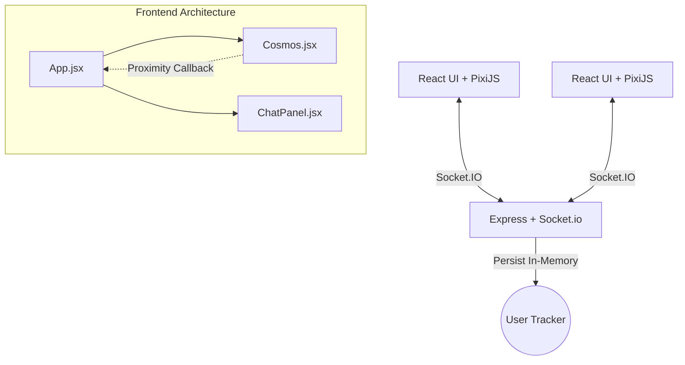

# Virtual Cosmos 🌌

A real-time 2D multiplayer virtual environment where users can move around in a shared world. The defining feature is **proximity-based chat**: as users approach each other, a chat panel seamlessly connects them. When they move apart, the connection breaks.

 *(Placeholder for app screenshot)*

## 🚀 Overview

**Virtual Cosmos** functions similarly to a small game engine intertwined with a communication platform. It highlights how web technologies like WebSockets, Canvas Rendering (via PixiJS), and React can be composed into highly interactive, low-latency applications.

## ✨ Features

- **Real-Time Multiplayer** synchronized across all connected clients.
- **Proximity Chat System**: Automatically join a private socket room when moving close to another player (< 120px) to chat.
- **Dynamic Render Loop**: Utilizes PixiJS v8 inside a React `useEffect` for optimal 60fps rendering.
- **Network Optimization**: Client movement is throttled to 20 updates per second, while remote play positions use simple linear interpolation (Lerp) for butter-smooth visual movement.
- **Connection Indicator**: Visual HUD overlay paints a neon tether line when two users establish proximity, confirming their chat link visually.
- **Premium UI**: Uses tailwind classes with glassmorphism overlays to ensure a top-tier look and feel.

## 🛠 Tech Stack

- **Frontend:** React 19, PixiJS v8, Socket.io-Client, Vite, Tailwind CSS 4
- **Backend:** Node.js, Express, Socket.io
- **Styling:** Tailwind CSS + custom UI components

## 🏗 Architecture Diagram



## 🧠 Core Systems Explained

### 1. PixiJS Rendering & React Flow
`Cosmos.jsx` is the heart of the frontend. Instead of using wrappers that often fall out of sync with Pixi upgrades, we instantiate `PIXI.Application` locally within a `useEffect` hook. A single canvas node receives the renderer, while `app.ticker.add` continuously loops (usually at display refresh rate) executing movement, interpolation, and proximity logic. Local players get a subtle glowing sprite distinct from remote players.

### 2. Real-Time Sync & Interpolation
Rather than sending every single frame of a player's movement (which would overload the server and cause jitter over average networks), character inputs locally update the coordinate state and emit the update at a throttled rate (max ~20 events/sec via checking `Date.now() - lastEmitTime > 50`). 
Simultaneously, `userMoved` responses from the backend update `targetX` and `targetY` positions for remote players. On every frame, Remote players drift gracefully towards their `target` coordinates iteratively, hiding latency seamlessly.

### 3. Proximity Detection Logic
Within the `checkProximity` loop, the client determines the Euclidean distance to every other player using standard Pythagorean distance:
`distance = Math.sqrt((x1 - x2)^2 + (y1 - y2)^2)`

When an active target is closer than our `radius` (120 pixels):
1. A visual line is drawn connecting the avatars.
2. The UI conditionally displays the `ChatPanel`.
3. A unique room identifier is created (e.g. `room-A-B`) and sent to the server.

### 4. Socket Architecture & Chat
The server maintains a lightweight dictionary of Active Users (`socket.id -> x, y`).
When proximity is established locally, `socket.emit('joinRoom', canonicalName)` fires. Only those in that Socket.IO room receive chat broadcasts (`socket.to(room).emit('chatMessage')`), ensuring robust isolation without extra data tables. Breaking proximity emits `leaveRoom`.

---

## 💻 Installation & Quickstart

### Running Backend 
1. Navigate to the backend directory:
   ```bash
   cd backend
   ```
2. Install dependencies (if not already cached):
   ```bash
   npm install
   ```
3. Start the server (runs on `localhost:3000`):
   ```bash
   node server.js
   ```

### Running Frontend
1. Open a new terminal and navigate to the frontend directory:
   ```bash
   cd frontend
   ```
2. Install dependencies:
   ```bash
   npm install
   ```
3. Run the Vite development server:
   ```bash
   npm run dev
   ```

### 🧪 Testing Multiplayer Locally

1. Make sure your local Backend server is running.
2. Run the frontend dev server.
3. Open `http://localhost:5173` in **two separate browser windows** side-by-side.
4. Click inside the canvas on each to ensure window focus.
5. Use `W, A, S, D` keys to move the avatars.
6. Drive one avatar near another (< 120 pixels).
7. Notice the tether line activates and the majestic Chat Panel opens.
8. Type messages, ensuring text only appears in the active proximity. Drive away to close the connection.

## 🔮 Future Improvements
- **Data Persistence:** Store user credentials and past messages with MongoDB and Redis.
- **Audio Proximity:** Integrate WebRTC logic to modulate audio channels based on exact character separation distance (Spatial Audio).
- **Collision Zones:** Create solid environmental structures parsing tilemaps that characters cannot navigate through.